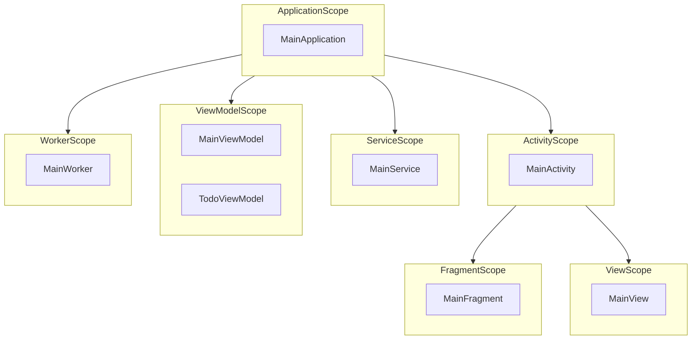

# Whetstone Dependency-Graph Visualization — Spec

**Branch:** `feature/dep-graph`
**Status:** spec / in progress

## Goal

Generate a **Mermaid** diagram of the Whetstone DI graph at build time, so a
developer can *see* the scope hierarchy and which classes are contributed into
each scope without reading generated Kotlin.

The data already exists: the `WhetstoneSymbolProcessor` (KSP) sees every
`@Contributes*`-annotated class with its target scope and (for instance
bindings) its base type, and the scope hierarchy is fixed. We surface it.

## What the graph shows

**Nodes**
- Scope markers as **subgraphs**: `ApplicationScope`, `ActivityScope`,
  `FragmentScope`, `ViewScope`, `ServiceScope`, `ViewModelScope`, `WorkerScope`.
- Each contributed class as a node inside its scope subgraph, tagged by kind:
  - injector (`@ContributesAppInjector` / `Activity` / `View` / `Service`)
  - instance/multibinding (`@ContributesFragment` → `Fragment`,
    `@ContributesViewModel` → `ViewModel`, `@ContributesWorker` →
    `ListenableWorker`)

**Edges**
- Fixed scope-parent hierarchy (from the component `@GraphExtension` +
  `@ContributesTo(parent)` wiring):
  ```
  ApplicationScope ──▶ ActivityScope ──▶ FragmentScope
                   │                  └─▶ ViewScope
                   ├─▶ ServiceScope
                   ├─▶ ViewModelScope
                   └─▶ WorkerScope
  ```

## Architecture — "at build time", two-stage

Each module's KSP run only sees its own classes (Metro assembles across modules
later), so a single processor pass can't see the whole app. Split the work:

### Stage 1 — processor emits a per-module graph **fragment** (KSP-time)
`WhetstoneSymbolProcessor`, alongside its existing codegen, writes a small
machine-readable fragment describing what it discovered in **this** module:

```
build/generated/ksp/<variant>/resources/whetstone/graph/<module-hash>.json
```
Record shape (one per contributed class):
```json
{ "fqName": "…MainActivity", "scope": "ActivityScope", "kind": "injector", "base": null }
```
Written via the KSP `CodeGenerator` (`createNewFileByPath`, extension `json`).
No new dependency the processor doesn't already have.

### Stage 2 — Gradle task renders **Mermaid** (post-build)
`whetstone-gradle-plugin` registers a task `whetstoneDepGraph` that:
1. Collects this module's fragment(s) + (Phase 2) dependency modules' fragments
   via a Gradle artifact configuration.
2. Merges them, de-dupes, groups by scope.
3. Renders `flowchart TD` Mermaid with one `subgraph` per scope + hierarchy
   edges, to:
   ```
   build/reports/whetstone/dep-graph.md   (```mermaid fenced, viewable on GitHub)
   build/reports/whetstone/dep-graph.mmd   (raw, for mmdc)
   ```
4. Prints the report path. Wired so a normal build can trigger it, or it can be
   run standalone: `./gradlew :sample:whetstoneDepGraph`.

## Phasing

- **Phase 1 (MVP — this goal):** processor emits JSON fragment; Gradle task
  renders the **current module's** graph. Verified on `:sample` and
  `:sample-library` — each produces a valid Mermaid graph of its own
  contributions with correct scope placement.
- **Phase 2:** cross-module aggregation via an inter-module Gradle configuration
  so `:sample:whetstoneDepGraph` renders the **whole app** graph (sample +
  sample-library together). Test fixtures + a unit test for the renderer.
- **Phase 3 (stretch):** optional `mmdc` render to SVG/PNG; per-scope binding
  detail (provider edges), if the data justifies it.

## Example output (sample, target shape)

````markdown

````

## Non-goals
- Runtime/reflective graph extraction (this is build-time only).
- Visualizing every provider/binding edge in Phase 1 (just class → scope).
- Replacing Metro's own diagnostics.

## Key source anchors
- Processor: `whetstone-compiler/.../WhetstoneSymbolProcessor.kt` (collects
  `bindings: List<ScopedProperty(scope, property)>`, `byScope` grouping).
- Scope hierarchy: encoded in `*Component.kt` `@GraphExtension(scope)` +
  `@GraphExtension.Factory @ContributesTo(parentScope)`.
- Plugin hook: `whetstone-gradle-plugin/.../WhetstonePlugin.kt` (applies KSP;
  `afterEvaluate`).
- KSP registration: `whetstone-compiler/.../META-INF/services/…SymbolProcessorProvider`.

## Success contract (the goal)
- **Done:** `./gradlew :sample:whetstoneDepGraph` (and `:sample-library:…`)
  writes `build/reports/whetstone/dep-graph.md` whose Mermaid parses cleanly and
  shows every contributed class under the correct scope subgraph with the right
  hierarchy edges. Phase 2: `:sample:whetstoneDepGraph` shows the merged
  app+library graph. Renderer has a unit test over fixtures.
- **Failure:** build breaks, no/empty report, invalid Mermaid, or a class lands
  in the wrong scope.
- **Stop & ask:** if cross-module fragment sharing needs a risky Gradle
  configuration/variant change, or KSP can't emit the resource cleanly — surface
  options before forcing it.
